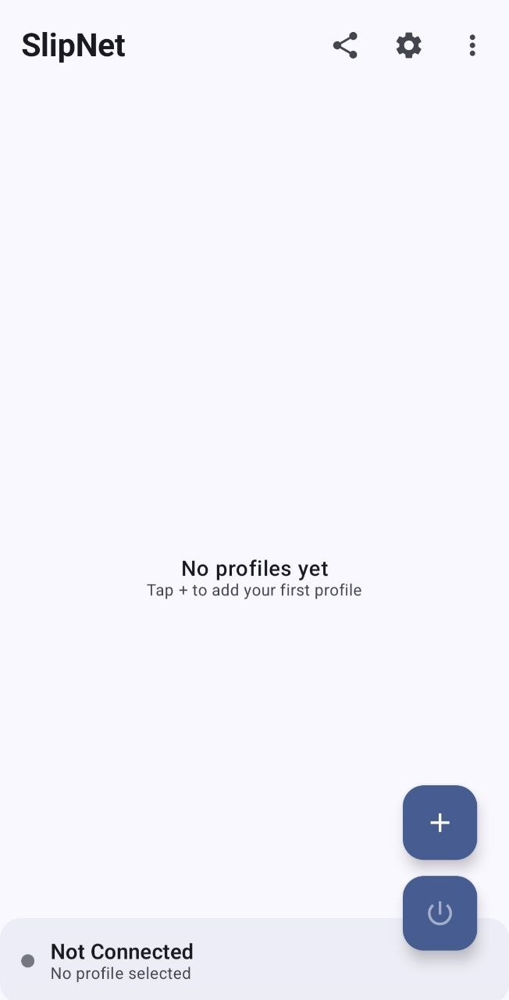
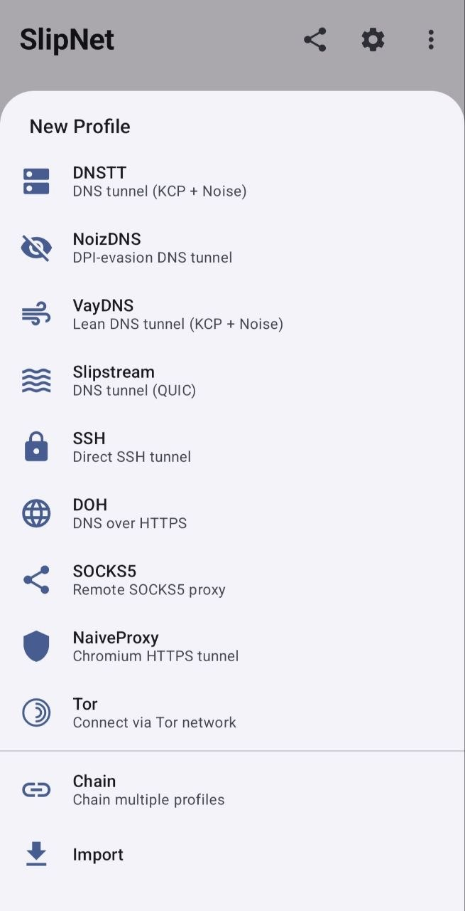
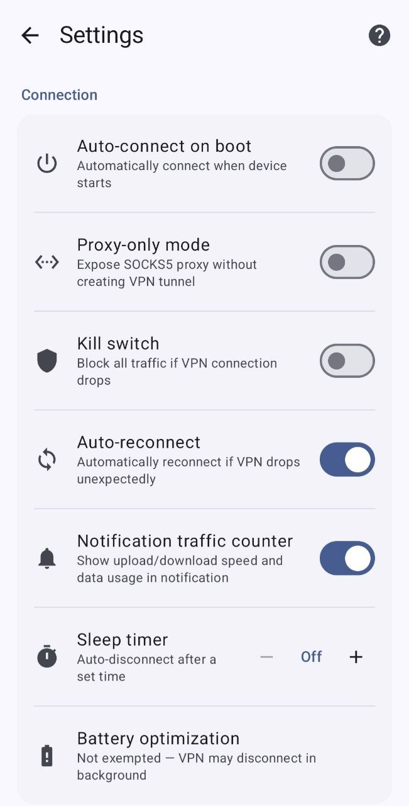

# SlipNet

> **⚠️ NOTICE:** This project is protected under the [SlipNet Source-Available License](LICENSE). You may **not** copy, redistribute, or publish this app — in source or binary form — on **any** app store, website, or platform. You may **not** use the SlipNet name, logo, or any part of the code in your own projects. Violations will result in a **DMCA takedown** and may lead to the **permanent suspension of your account**.

> **SlipNet is NOT available on any app store.** Any version you find on Google Play, the Apple App Store, or any other marketplace is **not published by us** and may be outdated, modified, or unsafe. The only official sources are this GitHub repository and our [Telegram channel](https://t.me/SlipNet_app).

<p align="center">
  
</p>

A fast, modern VPN client featuring DNS tunneling with support for multiple protocols. Available as an Android app (Jetpack Compose + Kotlin) and a cross-platform CLI client (Go).

> **This is a legitimate source-available anti-censorship tool** designed to help users in countries with internet censorship access the free internet. It is comparable to [Tor](https://www.torproject.org/), [Psiphon](https://psiphon.ca/), [Outline VPN](https://getoutline.org/) (Google Jigsaw), and [dnstt](https://www.bamsoftware.com/software/dnstt/). This project does not target, exploit, or attack any systems — it is a client-side privacy tool used voluntarily by end users.

## Community

Join our Telegram channel for updates, support, and discussions:

[](https://t.me/SlipNet_app)

## Tunnel Types

SlipNet supports multiple tunnel types with optional SSH chaining:

| Tunnel Type | Protocol | Description |
|-------------|----------|-------------|
| **DNSTT** | KCP + Noise | Stable and reliable DNS tunneling |
| **DNSTT + SSH** | KCP + Noise + SSH | DNSTT with SSH chaining for zero DNS leaks |
| **NoizDNS** | KCP + Noise | DPI-resistant DNS tunneling |
| **NoizDNS + SSH** | KCP + Noise + SSH | NoizDNS with SSH chaining |
| **VayDNS** | KCP + Noise | Optimized DNS tunneling with configurable wire format |
| **VayDNS + SSH** | KCP + Noise + SSH | VayDNS with SSH chaining |
| **Slipstream** | QUIC | High-performance QUIC tunneling |
| **Slipstream + SSH** | QUIC + SSH | Slipstream with SSH chaining |
| **SSH** | SSH | Standalone SSH tunnel (no DNS tunneling) |
| **NaiveProxy** | HTTPS (Chromium) | HTTPS tunnel with authentic Chrome TLS fingerprinting |
| **NaiveProxy + SSH** | HTTPS + SSH | NaiveProxy with SSH chaining for extra encryption |
| **DOH** | DNS over HTTPS | DNS-only encryption via HTTPS (RFC 8484) |
| **Tor** | Tor Network | Connect via Tor with Snowflake, obfs4, Meek, or custom bridges |

**Note:** DNSTT is the default and recommended tunnel type for most users. NoizDNS adds DPI resistance on top of DNSTT for censored networks. VayDNS offers an optimized wire format with configurable QNAME lengths, record types, and rate limiting. SSH variants add an extra layer of encryption and can prevent DNS leaks.

## Features

- **Modern UI**: Built entirely with Jetpack Compose and Material 3 design
- **Multiple Tunnel Types**: DNSTT, NoizDNS, VayDNS, Slipstream, SSH, NaiveProxy, DOH, and Tor with optional SSH chaining
- **NoizDNS**: DPI-resistant DNS tunneling with optional stealth mode
- **VayDNS**: Optimized DNS tunneling with configurable wire format, record types, QNAME lengths, and rate limiting
- **SSH Tunneling**: Chain SSH through DNSTT, NoizDNS, VayDNS, Slipstream, or NaiveProxy, or use standalone SSH
- **SSH over TLS**: Wrap SSH in TLS with custom SNI for domain fronting and DPI bypass
- **SSH over WebSocket**: Tunnel SSH through WebSocket (ws/wss) for CDN-based proxying (Cloudflare, etc.)
- **SSH over HTTP CONNECT**: Route SSH through HTTP CONNECT proxies with custom Host headers
- **SSH Payload Injection**: Send raw bytes before SSH handshake to disguise traffic for DPI bypass
- **NaiveProxy**: Chromium-based HTTPS tunnel with authentic TLS fingerprinting to evade DPI
- **DNS over HTTPS**: Encrypt DNS queries via HTTPS without tunneling other traffic
- **DNS Transport Selection**: Choose UDP, DoT, or DoH for DNSTT DNS resolution
- **SSH Cipher Selection**: Choose between AES-128-GCM, ChaCha20, and AES-128-CTR
- **DNS Server Scanning**: Automatically discover and test compatible DNS servers with EDNS probing, NXDOMAIN hijacking detection, and country-based IP range scanning
- **Multiple Profiles**: Create and manage multiple server configurations
- **Configurable Proxy**: Set custom listen address and port
- **Quick Settings Tile**: Toggle VPN connection directly from the notification shade
- **Auto-connect on Boot**: Optionally reconnect VPN when device starts
- **APK Sharing**: Share the app via Bluetooth or other methods in case of internet shutdowns
- **Debug Logging**: Toggle detailed traffic logs for troubleshooting
- **Dark Mode**: Full support for system-wide dark theme

## Server Setup

To use this client, you must have a compatible server. Please configure your server using one of the following deployment scripts:

**NoizDNS (recommended for censored networks):**
[**noizdns-deploy**](https://github.com/anonvector/noizdns-deploy) — One-click NoizDNS server with interactive management menu. Auto-detects both DNSTT and NoizDNS clients.

**DNSTT + Slipstream (combined):**
[**dnstm**](https://github.com/net2share/dnstm) — DNS Tunnel Manager supporting both Slipstream and DNSTT with SOCKS5, SSH, and Shadowsocks backends

**DNSTT**:
[**dnstt-deploy**](https://github.com/bugfloyd/dnstt-deploy)

**Slipstream:**
[**slipstream-rust-deploy**](https://github.com/AliRezaBeigy/slipstream-rust-deploy)

**NaiveProxy:**
[**slipgate**](https://github.com/anonvector/slipgate)

## Screenshots

### Current UI (v1.9+)

<p align="center">
  
  &nbsp;&nbsp;
  
  &nbsp;&nbsp;
  
</p>

### Legacy UI (pre-v1.9)

<p align="center">
  
  &nbsp;&nbsp;
  
  &nbsp;&nbsp;
  
</p>

## Requirements

### Android App
- Android 7.0 (API 24) or higher
- Android Studio Hedgehog (2023.1.1) or later
- JDK 17
- Rust toolchain (for building the native library)
- Android NDK 29

### CLI Client
- Go 1.24+ (auto-downloaded via GOTOOLCHAIN if needed)
- No external dependencies — fully self-contained (native Go SSH, no `ssh`/`sshpass` binaries needed)

## Building (Android)

### Prerequisites

1. **Install Rust**
   ```bash
   curl --proto '=https' --tlsv1.2 -sSf https://sh.rustup.rs | sh
   ```

2. **Add Android targets**
   ```bash
   rustup target add aarch64-linux-android armv7-linux-androideabi i686-linux-android x86_64-linux-android
   ```

3. **Set up OpenSSL for Android**

   OpenSSL will be automatically downloaded when you build for the first time. You can also set it up manually:
   ```bash
   ./gradlew setupOpenSsl
   ```

   This will download pre-built OpenSSL libraries or build from source if the download fails. OpenSSL files will be installed to `~/android-openssl/android-ssl/`.

   To verify your OpenSSL setup:
   ```bash
   ./gradlew verifyOpenSsl
   ```

### Build Steps

1. **Clone the repository**
   ```bash
   git clone https://github.com/anonvector/SlipNet.git
   cd SlipNet
   ```

2. **Initialize submodules**
   ```bash
   git submodule update --init --recursive
   ```

3. **Build the project**
   ```bash
   ./gradlew assembleDebug
   ```

   Or open the project in Android Studio and build from there.

## CLI Client

SlipNet includes a cross-platform CLI client for **macOS**, **Linux**, and **Windows**. It supports DNSTT, NoizDNS, VayDNS, SSH, and SOCKS5 tunnel types. It connects using a `slipnet://` config URI and starts a local SOCKS5 proxy. For a GUI alternative, see [SlipStreamGUI](https://github.com/mirzaaghazadeh/SlipStreamGUI).

### Download

Pre-built binaries are available on the Releases page:

| Platform | Binary |
|----------|--------|
| macOS (Apple Silicon) | `slipnet-darwin-arm64` |
| macOS (Intel) | `slipnet-darwin-amd64` |
| Linux (x64) | `slipnet-linux-amd64` |
| Linux (ARM64) | `slipnet-linux-arm64` |
| Windows (x64) | `slipnet-windows-amd64.exe` |

### CLI Usage

```bash
# Basic usage — auto-detects server if DNS delegation isn't set up
./slipnet 'slipnet://BASE64...'

# Specify a custom DNS resolver
./slipnet --dns 1.1.1.1 'slipnet://BASE64...'

# Use a custom local proxy port
./slipnet --port 9050 'slipnet://BASE64...'

# Limit DNS query size (smaller = stealthier, slower)
# Presets: 100 (large), 80 (medium), 60 (small), 50 (minimum)
./slipnet --max-query-size 80 'slipnet://BASE64...'

# Randomize query size with padding (e.g. 50–70 byte queries)
./slipnet --max-query-size 50 --query-padding 20 'slipnet://BASE64...'

# Show version
./slipnet --version
```

Once connected, configure your apps to use the SOCKS5 proxy:

```bash
# Test with curl
curl --socks5-hostname 127.0.0.1:1080 https://ifconfig.me

# If the server requires SOCKS5 authentication (username:password)
curl --socks5-hostname user:pass@127.0.0.1:1080 https://ifconfig.me

# Firefox: Settings → Network → SOCKS5 proxy: 127.0.0.1:1080
#          Check "Proxy DNS when using SOCKS v5"

# Chrome (launch with proxy flag):
google-chrome --proxy-server="socks5://127.0.0.1:1080"
```

The CLI auto-detects when DNS delegation isn't available and falls back to connecting directly to the server via its NS record.

### Tunnel Types & Transport Guide

All transport settings (TLS, WebSocket, HTTP CONNECT, payload) are embedded in the `slipnet://` config URI exported from the app. The CLI auto-detects the tunnel type and transport — no extra flags needed.

#### DNS Tunnels (DNSTT, NoizDNS, VayDNS)

DNS tunnels encode traffic in DNS queries. The config specifies the tunnel type, and the CLI handles everything automatically.

```bash
# DNSTT — reliable DNS tunneling (default)
./slipnet 'slipnet://BASE64...'

# NoizDNS — DPI-resistant DNS tunneling
./slipnet 'slipnet://BASE64...'

# VayDNS — optimized wire format with configurable record types and QNAME
./slipnet 'slipnet://BASE64...'

# Override DNS resolver (useful when ISP blocks certain resolvers)
./slipnet --dns 1.1.1.1 'slipnet://BASE64...'

# Connect directly to server (bypass recursive resolvers)
./slipnet --direct 'slipnet://BASE64...'

# Override uTLS fingerprint for DoH/DoT transports
./slipnet --utls Chrome_120 'slipnet://BASE64...'

# Limit query size for restrictive networks
./slipnet --max-query-size 80 'slipnet://BASE64...'
```

#### DNS + SSH Tunnels (DNSTT+SSH, NoizDNS+SSH, VayDNS+SSH)

SSH is chained through the DNS tunnel for an extra layer of encryption and zero DNS leaks.

```bash
# DNS tunnel carries raw SSH — all settings from config
./slipnet 'slipnet://BASE64...'

# Override port and DNS resolver
./slipnet --port 9050 --dns 8.8.8.8 'slipnet://BASE64...'
```

#### Standalone SSH Tunnel

Connects directly via SSH and runs a SOCKS5 proxy through the SSH session. No external `ssh` or `sshpass` binaries needed — uses native Go SSH.

```bash
# Plain SSH — credentials and host from config
./slipnet 'slipnet://BASE64...'

# Custom local port
./slipnet --port 9050 'slipnet://BASE64...'
```

#### SSH over TLS (stunnel-style)

The config enables TLS wrapping with a custom SNI hostname. The CLI wraps the SSH connection in TLS automatically — useful for bypassing DPI that blocks SSH.

```bash
# Config has sshTlsEnabled=true, sshTlsSni=cdn.example.com
# CLI auto-detects and wraps SSH in TLS
./slipnet 'slipnet://BASE64...'
```

Connection flow: `TCP → TLS (custom SNI) → SSH → SOCKS5`

#### SSH over HTTP CONNECT Proxy

Routes SSH through an HTTP CONNECT proxy. Supports custom Host headers for CDN-based facades.

```bash
# Config has sshHttpProxyHost, sshHttpProxyPort, optional custom Host header
./slipnet 'slipnet://BASE64...'
```

Connection flow: `TCP → HTTP CONNECT tunnel → (optional TLS) → SSH → SOCKS5`

#### SSH over WebSocket

Tunnels SSH through a WebSocket connection. Compatible with CDN WebSocket proxies (Cloudflare Workers, xray, wstunnel, websockify, etc.).

```bash
# Config has sshWsEnabled=true, sshWsPath, sshWsUseTls, optional custom Host
./slipnet 'slipnet://BASE64...'
```

Connection flow (wss): `TCP → TLS → WebSocket upgrade → WS frames → SSH → SOCKS5`
Connection flow (ws): `TCP → WebSocket upgrade → WS frames → SSH → SOCKS5`

#### SSH with Payload (DPI Bypass)

Sends raw bytes before the SSH handshake to disguise the initial connection. The payload supports placeholders that are resolved at connect time.

```bash
# Config has sshPayload with template like "GET / HTTP/1.1\r\nHost: [host]\r\n\r\n"
./slipnet 'slipnet://BASE64...'
```

Connection flow: `TCP → raw payload bytes → (optional TLS) → SSH → SOCKS5`

Supported placeholders: `[host]` (SSH server), `[port]` (SSH port), `[crlf]` (`\r\n`), `[cr]` (`\r`), `[lf]` (`\n`)

#### Direct SOCKS5

Forwards to a remote SOCKS5 proxy (e.g., microsocks on the server) via SSH port forwarding.

```bash
# Config has tunnel type "socks5" or "direct_socks"
./slipnet 'slipnet://BASE64...'
```

### Scanner

The CLI includes a built-in DNS scanner with multiple scan modes:

#### DNS Scan

Tests resolvers for DNS tunnel compatibility using EDNS probing, NXDOMAIN hijacking detection, and latency measurement. Each resolver gets a score from 0–6.

```bash
# Scan with a file of resolver IPs
./slipnet scan --domain t.example.com --ips resolvers.txt

# Scan a single IP
./slipnet scan --domain t.example.com --ip 8.8.8.8

# Use the built-in resolver list
./slipnet scan --domain t.example.com
```

#### DNS Scan + E2E

Runs DNS scanning and automatically feeds resolvers meeting the score threshold into end-to-end tunnel tests. Each E2E test starts a real tunnel through the resolver and makes an HTTP request.

```bash
# Using a slipnet:// config (auto-extracts domain, pubkey, and mode)
./slipnet scan --config 'slipnet://BASE64...' --ips resolvers.txt

# Manual domain + pubkey
./slipnet scan --domain t.example.com --ips resolvers.txt --e2e --pubkey HEXKEY

# With NoizDNS mode
./slipnet scan --domain t.example.com --ips resolvers.txt --e2e --pubkey HEXKEY --noizdns

# With VayDNS mode
./slipnet scan --domain t.example.com --ips resolvers.txt --e2e --pubkey HEXKEY --vaydns
```

#### E2E Test Only

Skips the DNS scan entirely and runs E2E tunnel tests directly on the provided resolvers. Useful when you already have a list of known-good resolvers and want to verify tunnel connectivity.

```bash
# Using a slipnet:// config
./slipnet scan --config 'slipnet://BASE64...' --ips resolvers.txt --e2e-only

# Manual domain + pubkey
./slipnet scan --domain t.example.com --pubkey HEXKEY --ips resolvers.txt --e2e-only

# With custom concurrency and timeout
./slipnet scan --config 'slipnet://BASE64...' --ips resolvers.txt --e2e-only --e2e-concurrency 20 --e2e-timeout 20000
```

#### Prism (Server-Verified Scan)

Sends HMAC-authenticated probes to verify that the tunnel server is genuine. Requires [SlipGate](https://github.com/anonvector/slipgate) running on the server.

```bash
# Using a slipnet:// config
./slipnet scan --config 'slipnet://BASE64...' --ips resolvers.txt --verify

# Manual domain + pubkey with custom probe settings
./slipnet scan --domain t.example.com --pubkey HEXKEY --ips resolvers.txt --verify --rounds 5 --threshold 2
```

### Interactive Mode

Running `./slipnet` with no arguments launches an interactive menu with all modes accessible via numbered options:

```
  1) Connect (DNSTT / NoizDNS / VayDNS / Slipstream)
  2) DNS Scanner
  3) DNS Scanner + E2E Test
  4) Quick Scan (single IP)
  5) Prism (server-verified scan)
  6) E2E Test Only
  7) Help
  0) Exit
```

### Building CLI from Source

```bash
git clone https://github.com/anonvector/SlipNet.git
cd SlipNet
git submodule update --init --recursive
cd cli
CGO_ENABLED=0 go build -trimpath -ldflags="-s -w" -o slipnet .
```

Cross-compile for other platforms:

```bash
# Linux
CGO_ENABLED=0 GOOS=linux GOARCH=amd64 go build -trimpath -ldflags="-s -w" -o slipnet-linux-amd64 .

# Windows
CGO_ENABLED=0 GOOS=windows GOARCH=amd64 go build -trimpath -ldflags="-s -w" -o slipnet-windows-amd64.exe .

# macOS Intel
CGO_ENABLED=0 GOOS=darwin GOARCH=amd64 go build -trimpath -ldflags="-s -w" -o slipnet-darwin-amd64 .
```

## Project Structure

```
cli/                        # Cross-platform CLI client (Go)
├── main.go                 # URI parser, tunnel client, SOCKS5 proxy
├── go.mod
└── go.sum
app/
├── src/main/
│   ├── java/app/slipnet/
│   │   ├── data/               # Data layer (repositories, database, native bridge)
│   │   │   ├── local/          # Room database and DataStore
│   │   │   ├── mapper/         # Entity mappers
│   │   │   ├── native/         # JNI bridge to Rust
│   │   │   └── repository/     # Repository implementations
│   │   ├── di/                 # Hilt dependency injection modules
│   │   ├── domain/             # Domain layer (models, use cases)
│   │   │   ├── model/          # Domain models
│   │   │   ├── repository/     # Repository interfaces
│   │   │   └── usecase/        # Business logic use cases
│   │   ├── presentation/       # UI layer (Compose screens)
│   │   │   ├── common/         # Shared UI components
│   │   │   ├── home/           # Home screen
│   │   │   ├── navigation/     # Navigation setup
│   │   │   ├── profiles/       # Profile management screens
│   │   │   ├── settings/       # Settings screen
│   │   │   └── theme/          # Material theme configuration
│   │   ├── service/            # Android services
│   │   │   ├── SlipNetVpnService.kt
│   │   │   ├── QuickSettingsTile.kt
│   │   │   └── BootReceiver.kt
│   │   └── tunnel/             # VPN tunnel implementation
│   └── rust/                   # Rust native library
│       └── slipstream-rust/    # QUIC/DNS tunneling implementation
├── build.gradle.kts
└── proguard-rules.pro
```

## Architecture

SlipNet follows Clean Architecture principles with three main layers:

- **Presentation Layer**: Jetpack Compose UI with ViewModels
- **Domain Layer**: Business logic and use cases
- **Data Layer**: Repositories, Room database, and native Rust bridge

### Tech Stack

- **UI**: Jetpack Compose, Material 3
- **Architecture**: MVVM, Clean Architecture
- **DI**: Hilt
- **Database**: Room
- **Preferences**: DataStore
- **Async**: Kotlin Coroutines & Flow
- **Native**: Rust via JNI (QUIC protocol implementation)
- **SSH**: JSch (mwiede fork with AES-GCM, ChaCha20 support)
- **HTTP**: OkHttp (HTTP/2 for DoH requests)

## Configuration

### Server Profile

Each server profile contains:

- **Name**: Display name for the profile
- **Tunnel Type**: DNSTT, NoizDNS, VayDNS, Slipstream, SSH, NaiveProxy, DOH, Tor, or their SSH variants
- **Domain**: Server domain for DNS tunneling
- **Resolvers**: DNS resolver configurations

#### DNSTT / NoizDNS settings:
- **Public Key**: Server's Noise protocol public key (hex format)
- **DNS Transport**: UDP, TCP, DoT (DNS over TLS), or DoH (DNS over HTTPS)
- **Stealth Mode** (NoizDNS only): Trades speed for harder DPI detection

#### VayDNS-specific settings:
- **DNSTT Compatibility**: Use original dnstt wire format (8-byte ClientID) for dnstt server compatibility
- **Record Type**: DNS record type for downstream data (TXT, CNAME, A, AAAA, MX, NS, SRV)
- **Max QNAME Length**: Maximum query name wire length (default: 101)
- **Rate Limit (RPS)**: Maximum outgoing DNS queries per second (0 = unlimited)
- **Idle Timeout**: Session idle timeout in seconds
- **Keep-Alive**: smux keep-alive interval in seconds
- **UDP Timeout**: Per-query UDP response timeout in milliseconds
- **Max Data Labels**: Maximum number of data labels in the query name
- **Client ID Size**: ClientID size in bytes (default: 2)

#### Slipstream-specific settings:
- **Congestion Control**: QUIC congestion control algorithm (BBR, DCUBIC)
- **Keep-Alive Interval**: QUIC keep-alive interval in milliseconds
- **Authoritative Mode**: Use authoritative DNS resolution
- **GSO**: Generic Segmentation Offload for better performance

#### NaiveProxy settings (NaiveProxy, NaiveProxy+SSH):
- **Server Port**: Caddy server port (default 443)
- **Proxy Username**: HTTP proxy authentication username
- **Proxy Password**: HTTP proxy authentication password

#### SSH settings (SSH, DNSTT+SSH, NoizDNS+SSH, VayDNS+SSH, Slipstream+SSH, NaiveProxy+SSH):
- **SSH Host**: SSH server address
- **SSH Port**: SSH server port (default 22)
- **SSH Username/Password**: Authentication credentials
- **SSH Cipher**: Preferred encryption algorithm (AES-128-GCM, ChaCha20, AES-128-CTR)

#### SSH transport options (available for all SSH tunnel types):
- **SSH over TLS**: Wrap SSH in TLS with custom SNI hostname for domain fronting
- **HTTP CONNECT Proxy**: Route SSH through an HTTP CONNECT proxy with custom Host header for CDN facades
- **SSH over WebSocket**: Tunnel SSH through WebSocket (ws:// or wss://) with custom path and Host header, compatible with CDN proxies (Cloudflare Workers, xray, wstunnel, etc.)
- **SSH Payload**: Send raw bytes before the SSH handshake to disguise traffic (DPI bypass). Supports placeholders: `[host]`, `[port]`, `[crlf]`, `[cr]`, `[lf]`

#### DOH settings:
- **DoH Server URL**: HTTPS endpoint for DNS queries (e.g., `https://cloudflare-dns.com/dns-query`)

## Contributing

Contributions are welcome! Please feel free to submit a Pull Request.

1. Fork the repository
2. Create your feature branch (`git checkout -b feature/amazing-feature`)
3. Commit your changes (`git commit -m 'Add some amazing feature'`)
4. Push to the branch (`git push origin feature/amazing-feature`)
5. Open a Pull Request
   
## License & Usage

This project is released under the **SlipNet Source-Available License**.

**You are allowed to:**
- View, study, and modify the source code for **personal, private use**
- Use the software locally for educational or research purposes
- Fork the repository to submit contributions (Pull Requests) to the original project

**You are NOT allowed to:**
- **Distribute** this software (source or binary) to third parties
- **Publish** this application on app stores (including Google Play, F-Droid, or Apple App Store)
- **Commercialize** the software or any derivative works

See [LICENSE](./LICENSE) for the full legal terms.

## Name & Branding Notice

**"SlipNet"** is the reserved project name.

Use of the project name, logo, or branding in derivative works or republished versions is **strictly prohibited** without explicit written permission from the owner. This applies even if you have modified or forked the code.

## Distribution Notice

This project is **not authorized** for distribution on any application store, marketplace, or file-hosting service.

**If you find this application on Google Play, the Apple App Store, or any other marketplace, it is an UNAUTHORIZED build.** It may be outdated, modified, or malicious. Please download SlipNet only from the official repository.


## Acknowledgments

- [slipstream-rust](https://github.com/Mygod/slipstream-rust) - Rust QUIC tunneling library
- [Stream-Gate](https://github.com/free-mba/Stream-Gate) - DNS tunnel scanning method
